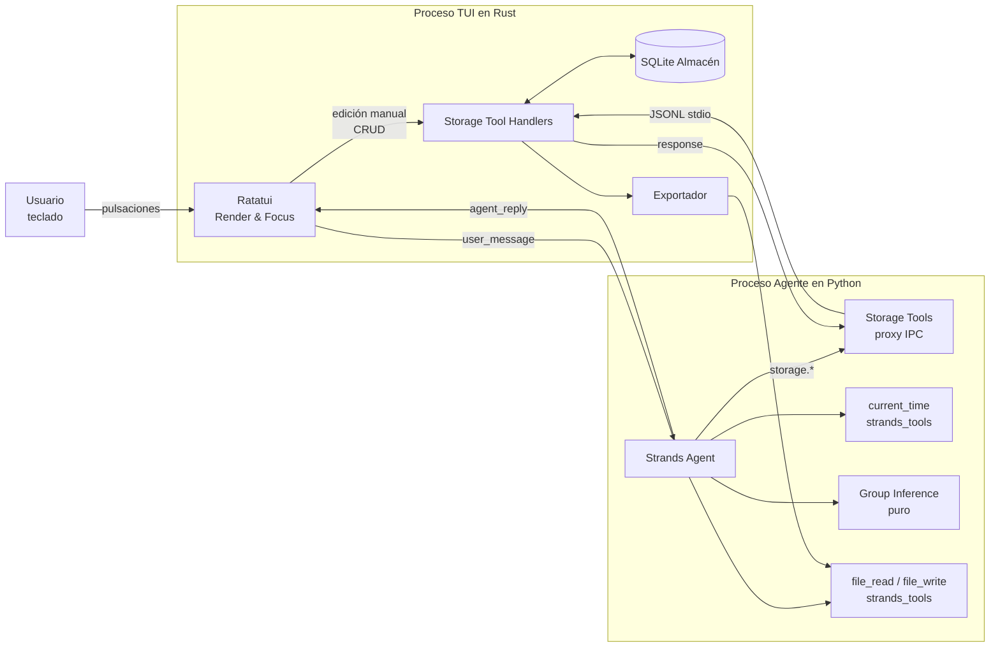

# Documento de Diseño

## Overview

El Organizador de Día en Terminal se estructura como dos procesos locales que cooperan: una **TUI en Rust con Ratatui** (proceso padre, dueño del ciclo de vida y del Almacén SQLite) y un **Agente en Python con Strands Agents** (proceso hijo, encargado del lenguaje natural). Ambos se comunican por un **Canal_IPC de JSON Lines sobre stdio**, con tráfico bidireccional: la TUI envía turnos de chat al Agente, y el Agente invoca herramientas de almacenamiento expuestas por la TUI cuando necesita leer o mutar el Almacén. La TUI también ejecuta edición manual (Requisito 13) directamente sobre el Almacén sin pasar por el Agente.

El diseño se sostiene en tres decisiones que atraviesan todo el documento:

1. **La TUI es la única dueña del Almacén SQLite.** El Agente no abre la base de datos; accede a ella únicamente a través de herramientas de almacenamiento expuestas por la TUI sobre el mismo Canal_IPC. Esto concentra en un solo lugar las transacciones, la validación y la notificación de cambios, y elimina la carrera de escritores entre procesos.
2. **Todo lo que debe ser verificable por propiedades es determinista y puro.** La inferencia de Grupo (Requisito 15.13), la serialización IPC (Requisito 10.3) y la exportación/importación SQLite (Requisito 8.5) no dependen del LLM ni del entorno: son funciones puras sobre estructuras de datos explícitas.
3. **El LLM se usa sólo para entender al usuario, no para decidir reglas de negocio.** Priorización, orden de listado, resolución temporal con un "ahora" fijo, inferencia de Grupo y transacciones se implementan en código determinista. El Agente traduce lenguaje natural a llamadas a herramientas; las herramientas contienen la lógica.

El diseño cubre todos los Requisitos 1 a 17 de `requirements.md`.

## Architecture

### Procesos y responsabilidades

- **Proceso TUI (Rust, Ratatui)**
  - Renderiza Panel_Chat, Panel_Tareas, Panel_Calendario, Panel_Proximos con foco único (Requisito 14).
  - Gestiona el ciclo de vida del proceso Agente como hijo.
  - Contiene al Almacén SQLite: esquema, migraciones, transacciones, lecturas.
  - Expone al Agente un conjunto de **Storage Tools** sobre el Canal_IPC.
  - Ejecuta edición manual (Requisito 13) llamando directamente a la capa de almacenamiento en proceso.
  - Implementa el Exportador (Requisito 8).
- **Proceso Agente (Python, Strands Agents)**
  - Recibe mensajes del usuario de la TUI por stdin.
  - Ejecuta un `Agent` de Strands con tres clases de herramientas:
    - Prehechas de `strands_tools` (Requisito 12.3): al menos `current_time` y las de sistema de archivos `file_read` / `file_write` / `editor` para el Exportador a Markdown.
    - **Storage Tools** locales al proceso Agente que hacen un round-trip IPC hacia la TUI (no tocan SQLite).
    - **Inference Tool** pura, local al proceso Agente, para inferencia de Grupo (Requisito 15.9–15.13).
  - Emite la respuesta final al usuario por stdout en un mensaje `agent_reply`.
- **Canal_IPC (stdio, JSONL)**
  - Un mensaje por línea, UTF-8, codificado como JSON. `\n` como delimitador; `\n` literales en contenido se escapan como `\\n` dentro del JSON.
  - Bidireccional sobre un único par stdin/stdout. Stderr del Agente se redirige a un archivo de log de la TUI.
  - Envelope común con `id`, `kind` (`request` | `response` | `event`), `type`, `payload`, `ref`.
- **Almacén (SQLite)**
  - Archivo único en el directorio de configuración del usuario (ver Storage Design).
  - Modo WAL activado; `PRAGMA foreign_keys = ON`.
- **Exportador**
  - Invocable desde la TUI o desde el Agente (vía Storage Tool `export`).
  - Produce Markdown (sección Tareas, Eventos, Grupos) o un archivo SQLite clon.

### Arranque y ciclo de vida

1. La TUI arranca, resuelve la ruta del Almacén, crea el archivo SQLite si falta y aplica migraciones (Requisito 7.4).
2. La TUI lanza al Agente como subproceso con stdin/stdout conectados y stderr redirigido a log.
3. La TUI envía un mensaje `agent_init` con la configuración (timezone del sistema, si el proveedor del modelo es local o remoto).
4. Si el proveedor del modelo es remoto, la TUI publica en el historial del Panel_Chat una nota del Agente según Requisito 9.4.
5. El bucle principal de la TUI procesa: eventos de teclado, líneas JSON del Agente, actualizaciones programadas del Panel_Proximos (tick de ≤1 s).
6. Al salir, la TUI envía `shutdown` al Agente y espera cierre grácil antes de terminar.

### Diagrama de flujo de datos



### Modelo de concurrencia

- La TUI usa un hilo de UI (Ratatui) y un hilo de IPC que lee líneas del stdout del Agente y las empuja a una cola. Las Storage Tool se atienden en el hilo de IPC dentro de transacciones SQLite cortas. El hilo de UI lee del Almacén mediante sentencias `SELECT` bajo una conexión separada en modo WAL.
- El Agente es de un solo hilo lógico: cada turno del usuario procesa un `user_message`, lanza N llamadas a herramientas (posiblemente varias Storage Tool), y emite un único `agent_reply`. Las llamadas a Storage Tool son sincrónicas desde el punto de vista del Agente: bloquea esperando la respuesta correspondiente por `ref`.
- El Almacén serializa escrituras con `BEGIN IMMEDIATE`; la confirmación (`COMMIT`) ocurre antes de que la TUI responda al Agente o refresque la vista, cumpliendo Requisitos 7.2 y 13.2/13.7/13.8/13.9.

## Components and Interfaces

### Proceso TUI (Rust)

#### Layout y foco (Requisito 14)

Disposición fija: columna izquierda con Panel_Chat (arriba) y Panel_Proximos (abajo); columna derecha con Panel_Tareas (arriba) y Panel_Calendario (abajo). Requisitos mínimos de tamaño: 100×30 columnas/filas. Si el terminal es menor, se muestra un mensaje con el tamaño mínimo y se bloquean las operaciones sobre el Almacén (Requisito 14.9).

```
+-----------------------------------------------+
| Panel_Chat                 | Panel_Tareas     |
|                            |                  |
+----------------------------+------------------+
| Panel_Proximos             | Panel_Calendario |
+-----------------------------------------------+
|  Barra de estado (atajos + avisos + errores)  |
+-----------------------------------------------+
```

**Máquina de estados de foco.** El estado mantiene `focused_panel ∈ {Chat, Tareas, Calendario, Proximos}`. La pulsación `Tab` avanza al siguiente panel en el orden fijo `Chat → Tareas → Calendario → Proximos → Chat`; `Shift+Tab` retrocede. `Esc` en un panel modal (formulario o diálogo de confirmación) lo cierra sin cambiar de foco. El panel enfocado muestra el borde resaltado con el estilo `Style::default().add_modifier(Modifier::BOLD)` y un título con sufijo `[ACTIVO]`.

**Ruteo de teclas.** El dispatcher principal consulta `focused_panel` y delega en el handler del panel. Teclas globales (`Tab`, `Shift+Tab`, `Ctrl+Q` para salir, `Ctrl+E` para abrir el diálogo de exportación) se interceptan antes del ruteo.

**Atajos por panel.**

| Panel            | Atajos                                                                                |
|------------------|----------------------------------------------------------------------------------------|
| Panel_Chat       | `Enter` enviar mensaje, `Ctrl+L` limpiar input, `PgUp`/`PgDn` scroll historial         |
| Panel_Tareas     | `n` nueva, `e` editar, `c` completar, `d` eliminar (con confirmación), `↑`/`↓` navegar |
| Panel_Calendario | `n` nuevo evento, `e` editar, `d` eliminar, `←`/`→` día previo/siguiente, `PgUp`/`PgDn` mes previo/siguiente |
| Panel_Proximos   | `Enter` saltar a la entrada en su panel origen                                         |

Una leyenda de atajos se renderiza en el pie de cada panel enfocado (Requisitos 14.6 y 14.7).

#### Formularios de edición manual (Requisito 13)

Los formularios son overlays modales sobre el panel que los lanzó. Cada formulario tiene:

- Campos con foco interno navegable con `Tab`.
- Validación al confirmar; errores se muestran en línea y se vuelve al primer campo con error.
- `Enter` en el botón "Guardar" envía la operación a la capa de almacenamiento dentro de una transacción `BEGIN IMMEDIATE ... COMMIT`. La TUI sólo actualiza su vista tras `COMMIT` exitoso (Requisitos 13.2, 13.3, 13.4, 13.5, 13.7, 13.8, 13.9).
- El diálogo de eliminación requiere una confirmación explícita pulsando `y` (Requisito 13.5, 13.9, 15.5).

Campos por formulario:

- **Tarea (crear/editar)**: título, Prioridad (alta/media/baja con selector), fecha límite opcional (date-picker), Grupo opcional (selector con lista de Grupos existentes y opción "— sin grupo —"). En edición se añade Estado_Tarea.
- **Evento (crear/editar)**: título, fecha, hora de inicio, duración en minutos opcional, Grupo opcional.
- **Grupo (crear/editar)**: nombre, Color_Grupo (input hex `#RRGGBB` o selector de 16 presets).

#### Renderizado de colores (Requisito 16)

La TUI detecta capacidades del terminal al arrancar usando `crossterm::terminal::supports_keyboard_enhancement` y consultando `$COLORTERM`, `$TERM` y `tput colors`. El resultado cae en uno de tres modos:

- **TrueColor (24 bits)**: se usa el hex exacto del Color_Grupo.
- **256 colores**: se mapea el hex al color más cercano de la paleta xterm-256 por distancia euclídea en RGB. Se muestra una advertencia en barra de estado (Requisito 16.4).
- **Sin color o monocromo**: en lugar del color se añade un marcador textual `[nombre_grupo]` como prefijo de la entrada (Requisito 16.5).

Las Tareas y Eventos sin Grupo se renderizan con un estilo neutro (`Color::Reset` o gris claro), distinto de cualquier Color_Grupo definido (Requisito 16.2). Para el Panel_Calendario, las Tareas se diferencian de los Eventos con un prefijo glifo reservado `▸` para Tareas y `●` para Eventos (Requisito 17.4), mantenido también cuando se aplica Color_Grupo (Requisito 17.5).

#### Notificaciones de cambio

La TUI mantiene un contador de versión del Almacén incrementado en cada `COMMIT`. El tick del bucle principal (cada 250 ms) compara la versión observada y, si cambió, recarga las vistas afectadas. Esto satisface el "≤1 segundo" de Requisitos 6.2, 13.10, 16.3 y 17.6 con amplio margen.

### Proceso Agente (Python)

#### Composición del agente

```python
from strands import Agent
from strands_tools import current_time, file_read, file_write, editor
from .storage_tools import (
    list_tasks, create_task, update_task, delete_task, complete_task,
    list_events, create_event, update_event, delete_event,
    list_groups, create_group, rename_group, recolor_group, delete_group,
    export_markdown, export_sqlite,
)
from .inference import infer_group_candidate  # tool determinista

agent = Agent(
    system_prompt=SYSTEM_PROMPT,
    tools=[
        current_time,            # Requisito 5.1, 12.3
        file_read, file_write,   # Requisito 12.3 (lectura/escritura delegada si el modelo la necesita)
        editor,                  # opcional, también de strands_tools
        # Storage tools proxy
        list_tasks, create_task, update_task, delete_task, complete_task,
        list_events, create_event, update_event, delete_event,
        list_groups, create_group, rename_group, recolor_group, delete_group,
        export_markdown, export_sqlite,
        # Inferencia de Grupo determinista
        infer_group_candidate,
    ],
)
```

Cada Storage Tool es una función Python `@tool` cuyo cuerpo construye un mensaje IPC `request` con `type = "storage.<op>"`, lo escribe por `stdout`, y bloquea leyendo líneas hasta encontrar una `response` con el mismo `ref`. Esto transforma el almacenamiento en un servicio remoto transparente para el LLM.

#### Uso de herramientas prehechas de `strands_tools` (Requisito 12.3)

- `current_time(timezone=...)`: invocada al inicio de cada turno para obtener un `now` ISO 8601 que se inyecta en el system prompt del turno. Es el único "ahora" autorizado del Agente, cubriendo Requisito 5.1.
- `file_read`, `file_write`, `editor`: disponibles para que el Agente pueda, por ejemplo, ofrecer previsualizar o anexar a un archivo Markdown existente cuando el usuario lo pida. La ruta de exportación "oficial" pasa por `export_markdown` / `export_sqlite` (Storage Tools) que llaman al Exportador a través de la TUI, pero la disponibilidad de `file_write` cumple Requisito 12.3 sin duplicar funcionalidad.

#### Resolución temporal (Requisito 5)

Estrategia en dos niveles:

1. **"Ahora" fijo por turno.** Al recibir un `user_message`, el Agente invoca `current_time` y guarda el resultado en `now_iso`. El system prompt del turno incluye literalmente `NOW = <now_iso>`. Esto fija el punto de referencia para toda la resolución temporal de ese turno.
2. **Extracción de fechas y horas relativas.** El LLM interpreta expresiones relativas ("hoy", "mañana", "en dos horas", "el viernes") y emite llamadas a Storage Tools con fechas/horas **absolutas** ya resueltas en formato ISO 8601. Si el LLM no puede resolver de forma unívoca (p. ej. "la próxima vez" sin contexto), responde pidiendo aclaración sin invocar herramientas (Requisito 5.3).

El Agente nunca pasa referencias relativas a las Storage Tools: sólo valores absolutos. Esto simplifica el Almacén y evita que el LLM "invente" un `now` distinto del que reporta `current_time`.

#### Inferencia de Grupo (Requisito 15.9–15.13)

Se implementa como una **función pura determinista** `infer_group_candidate(message, groups_snapshot) -> (group_id, score)`. No es una llamada al LLM. El Agente la usa cuando el usuario crea una Tarea o Evento desde el chat **sin mencionar un Grupo** y existen Grupos en el Almacén.

**Algoritmo.**

1. **Preparación del texto del Grupo.** Para cada Grupo `g` en `groups_snapshot`, construir `text(g) = normalize(name(g) + " " + " ".join(titles_of_tasks_and_events(g)))`, donde `normalize` convierte a minúsculas, elimina acentos con NFKD + descarte de marcas combinantes, y colapsa espacios.
2. **Preparación del texto del mensaje.** `text_msg = normalize(message)`.
3. **Extracción de n-gramas.** Conjunto de trigramas de caracteres (`n=3`) con padding `" "` al inicio y fin: `ngrams(s) = {s[i:i+3] for i in 0..len(s)-2}`.
4. **Puntuación.** `score(g) = |ngrams(text_msg) ∩ ngrams(text(g))| / max(1, |ngrams(text_msg) ∪ ngrams(text(g))|)` (Jaccard de trigramas en `[0, 1]`).
5. **Selección.** `candidate = argmax_g score(g)`. En caso de empate en el score, se desempata por `group_id` ascendente (determinismo estricto, Requisito 15.13).
6. **Umbralización.** El Agente aplica las reglas:
   - `score ≥ 0.75` → asignar automáticamente e informar (Requisito 15.10).
   - `0.25 ≤ score < 0.75` → proponer y pedir confirmación (Requisito 15.11).
   - `score < 0.25` → proponer crear un Grupo nuevo con nombre sugerido (Requisito 15.12).

El algoritmo cumple la propiedad determinista (Requisito 15.13) porque es puro, no depende del LLM, no usa aleatoriedad ni estado externo, y el desempate por id garantiza una única elección incluso con scores iguales.

### Canal_IPC

#### Transporte

- **Portador**: stdin/stdout del proceso Agente, heredados del proceso TUI. Stderr va a `<config_dir>/agent.log` y se consulta en caso de error.
- **Codificación**: una línea JSON por mensaje, UTF-8, terminada en `\n`. Líneas vacías se ignoran.
- **Motivación frente a socket Unix**: stdio funciona igual en Linux, macOS y Windows sin rutas de socket, sin colisiones y con limpieza automática al cerrar procesos. La latencia es comparable para volúmenes propios de un Organizador personal.

#### Envelope común

```json
{
  "v": 1,
  "id": "d3f4c1e6-...",
  "kind": "request" | "response" | "event",
  "type": "user_message" | "agent_reply" | "agent_init" | "agent_init_ack" |
          "shutdown" | "storage.list_tasks" | "storage.create_task" | "...",
  "payload": { },
  "ref": "id-de-la-request-a-la-que-responde",
  "error": { "code": "string", "message": "string" }
}
```

Reglas:

- `v=1` reservado para evolución futura del protocolo.
- `id` es un UUIDv4 generado por el emisor.
- `kind=request` y `kind=response` se correlacionan por `ref = request.id`.
- `kind=event` es unidireccional, sin respuesta; se usa para progreso o avisos (por ejemplo `agent_tool_progress`).
- En errores, `kind=response` con `error` no vacío y `payload` ausente.

#### Tipos de mensaje

**TUI → Agente:**

| type              | payload                                                |
|-------------------|--------------------------------------------------------|
| `agent_init`      | `{ "timezone": "Europe/Madrid", "model_provider": "local" | "remote" }` |
| `user_message`    | `{ "text": "crea una tarea..." }`                     |
| `shutdown`        | `{}`                                                   |

**Agente → TUI (chat):**

| type                   | payload                                                  |
|------------------------|----------------------------------------------------------|
| `agent_init_ack`       | `{ "provider_notice": "usando modelo remoto ..." | null }` |
| `agent_reply`          | `{ "text": "..." }`                                      |
| `agent_tool_progress`  | `{ "tool": "storage.create_task", "phase": "start" | "end" }` (kind=event) |

**Agente → TUI (storage, request):** `storage.list_tasks`, `storage.create_task`, `storage.update_task`, `storage.delete_task`, `storage.complete_task`, `storage.list_events`, `storage.create_event`, `storage.update_event`, `storage.delete_event`, `storage.list_groups`, `storage.create_group`, `storage.rename_group`, `storage.recolor_group`, `storage.delete_group`, `storage.export_markdown`, `storage.export_sqlite`.

**TUI → Agente (storage, response):** mismo `type` del request, `kind=response`, `ref` igual al `id` del request, y `payload` con el resultado o `error` con `code` + `message`.

Los esquemas concretos de cada `payload` se definen en la sección Data Models.

#### Timeout y errores (Requisitos 1.4 y 10.4)

- La TUI inicia un temporizador de 30 s tras cada `user_message`. Si no llega `agent_reply` a tiempo, muestra un mensaje de espera con opciones "Reintentar" y "Cancelar" (Requisito 10.4).
- Si la escritura/lectura sobre el pipe falla (EOF inesperado), la TUI marca el Agente como caído, muestra el error con la causa y ofrece reiniciarlo (Requisito 1.4).
- Cualquier `storage.*` fallida devuelve `error.code` alineado con la sección Error Handling; el Agente traduce esa causa a lenguaje natural en su `agent_reply` (Requisito 11.3).

### Almacén

Expone una API interna (en proceso TUI) con operaciones que corresponden una-a-una con las Storage Tools:

```rust
pub trait Storage {
    fn list_tasks(&self, filter: TaskFilter) -> Result<Vec<Task>, StorageError>;
    fn create_task(&self, input: NewTask) -> Result<Task, StorageError>;
    fn update_task(&self, id: i64, patch: TaskPatch) -> Result<Task, StorageError>;
    fn complete_task(&self, id: i64) -> Result<Task, StorageError>;
    fn delete_task(&self, id: i64) -> Result<(), StorageError>;
    // ... equivalentes para events y groups ...
    fn snapshot_for_inference(&self) -> Result<GroupsSnapshot, StorageError>;
    fn export(&self, target: ExportTarget) -> Result<PathBuf, StorageError>;
}
```

`TaskFilter` permite filtrar por estado, rango de fechas y Grupo. `TaskPatch` es una estructura con `Option<T>` por cada campo para distinguir "no modificar" de "poner a null". `snapshot_for_inference` devuelve, para cada Grupo, su id, nombre y los títulos de sus Tareas y Eventos; se usa para alimentar la inferencia de Grupo sin exponer otros datos.

Toda operación de escritura abre `BEGIN IMMEDIATE`, aplica la(s) sentencia(s) y hace `COMMIT` antes de devolver `Ok(...)`. Sólo entonces la TUI (o el handler IPC) responde (Requisitos 7.2, 13.2, 13.3, 13.4, 13.5, 13.7, 13.8, 13.9, 15.2).

### Exportador

Dos modos (Requisito 8):

- **Markdown**: genera un archivo con tres secciones `# Tareas`, `# Eventos`, `# Grupos`, cada una con una tabla Markdown que incluye todos los campos persistidos de cada entidad. Ordena Tareas por (Prioridad, fecha límite) y Eventos por (fecha, hora).
- **SQLite**: crea un archivo SQLite nuevo en la ruta indicada, aplica el mismo esquema que el Almacén, y copia en orden de dependencia: Grupos → Tareas → Eventos. No copia la tabla `schema_version` del origen; siempre escribe la versión actual del esquema.

Ambos fallan sin escribir nada si la ruta destino no es escribible (Requisito 8.4). La importación del SQLite exportado a un Almacén vacío está implementada en el propio Almacén con una operación `import_sqlite(path)` usada por tests y por el usuario si lo pide en el futuro; es el contrato que sostiene la propiedad round-trip del Requisito 8.5.

## Data Models

### Esquema SQLite

```sql
-- Metadatos del esquema
CREATE TABLE IF NOT EXISTS schema_version (
    version INTEGER PRIMARY KEY
);

-- Grupos (Requisito 15)
CREATE TABLE IF NOT EXISTS groups (
    id    INTEGER PRIMARY KEY AUTOINCREMENT,
    name  TEXT    NOT NULL UNIQUE,
    color TEXT    NOT NULL  -- hex "#RRGGBB" validado por la capa de almacenamiento
);

-- Tareas (Requisito 2, 13, 15, 17)
CREATE TABLE IF NOT EXISTS tasks (
    id         INTEGER PRIMARY KEY AUTOINCREMENT,
    title      TEXT    NOT NULL,
    priority   TEXT    NOT NULL CHECK (priority IN ('alta','media','baja')),
    status     TEXT    NOT NULL CHECK (status IN ('pendiente','completada','cancelada')),
    created_at TEXT    NOT NULL,  -- ISO 8601 con zona, p.ej. "2025-02-14T09:00:00+01:00"
    deadline   TEXT,              -- ISO 8601 con zona; NULL si sin fecha límite
    group_id   INTEGER,           -- NULL si la Tarea no tiene Grupo
    FOREIGN KEY (group_id) REFERENCES groups(id) ON DELETE SET NULL
);

-- Eventos (Requisito 3, 13, 15, 17)
CREATE TABLE IF NOT EXISTS events (
    id               INTEGER PRIMARY KEY AUTOINCREMENT,
    title            TEXT    NOT NULL,
    start_date       TEXT    NOT NULL,  -- "YYYY-MM-DD"
    start_time       TEXT    NOT NULL,  -- "HH:MM"
    duration_minutes INTEGER,           -- NULL si sin duración
    group_id         INTEGER,
    FOREIGN KEY (group_id) REFERENCES groups(id) ON DELETE SET NULL
);

-- Índices para consultas habituales
CREATE INDEX IF NOT EXISTS idx_tasks_status_priority  ON tasks(status, priority);
CREATE INDEX IF NOT EXISTS idx_tasks_deadline         ON tasks(deadline);
CREATE INDEX IF NOT EXISTS idx_tasks_group            ON tasks(group_id);
CREATE INDEX IF NOT EXISTS idx_events_start_date      ON events(start_date);
CREATE INDEX IF NOT EXISTS idx_events_group           ON events(group_id);
```

Decisiones:

- **FK opcional a `groups`** con `ON DELETE SET NULL`: al eliminar un Grupo, sus Tareas y Eventos quedan sin Grupo (Requisito 15.5) sin perder datos y sin acción extra del código.
- **Color como hex `#RRGGBB`**: formato canónico independiente del terminal. La traducción a ANSI/256/truecolor ocurre sólo en render (Requisito 16.4/16.5). Validado por la capa de almacenamiento con una regex.
- **Fechas y horas como texto ISO 8601**: compatible con funciones de fecha de SQLite, ordenable lexicográficamente, sin ambigüedad de zona.
- **`schema_version`**: permite migraciones futuras aditivas.

### Migraciones

Se mantiene una lista de migraciones indexadas por número de versión. Al arrancar, la TUI consulta `schema_version`, ejecuta en orden las migraciones con número mayor, cada una dentro de su propia transacción, y al final escribe la versión resultante. La migración 1 es exactamente el esquema anterior. La migración 0 → 1 se dispara cuando el archivo acaba de crearse (Requisito 7.4).

### Ubicación del archivo (Requisito 7.1, 9.2)

- **Linux**: `${XDG_CONFIG_HOME:-$HOME/.config}/terminal-day-organizer/organizer.sqlite3`.
- **macOS**: `$HOME/Library/Application Support/terminal-day-organizer/organizer.sqlite3`.
- **Windows**: `%APPDATA%\terminal-day-organizer\organizer.sqlite3`.

Resuelto con el crate `directories` (`ProjectDirs::from("", "", "terminal-day-organizer")`). El directorio se crea si no existe.

### Modelos Rust (Storage)

```rust
pub struct Group   { pub id: i64, pub name: String, pub color: HexColor }
pub struct Task {
    pub id: i64,
    pub title: String,
    pub priority: Priority,           // Alta | Media | Baja
    pub status: TaskStatus,           // Pendiente | Completada | Cancelada
    pub created_at: DateTime<FixedOffset>,
    pub deadline: Option<DateTime<FixedOffset>>,
    pub group_id: Option<i64>,
}
pub struct Event {
    pub id: i64,
    pub title: String,
    pub start_date: NaiveDate,
    pub start_time: NaiveTime,
    pub duration_minutes: Option<u32>,
    pub group_id: Option<i64>,
}
pub struct HexColor(String); // valida "#RRGGBB" en el constructor
```

### Esquemas de payload IPC

Todos los payloads se definen como structs Rust con `serde::{Serialize, Deserialize}` y como `TypedDict` en Python, compartiendo nombres de campo exactos. Lo que sigue describe los payloads clave; el resto de operaciones storage siguen el mismo patrón.

```jsonc
// type = "user_message" (request, TUI -> Agente)
{ "text": "crea una tarea urgente para mañana" }

// type = "agent_reply" (response, Agente -> TUI)
{ "text": "He creado la tarea ‘Comprar pan’ para el 15/02, prioridad alta." }

// type = "storage.create_task" (request, Agente -> TUI)
{
  "title": "Comprar pan",
  "priority": "alta",
  "deadline": "2025-02-15T09:00:00+01:00",  // opcional
  "group_id": 3                              // opcional
}
// response.payload
{
  "task": {
    "id": 42,
    "title": "Comprar pan",
    "priority": "alta",
    "status": "pendiente",
    "created_at": "2025-02-14T10:12:00+01:00",
    "deadline": "2025-02-15T09:00:00+01:00",
    "group_id": 3
  }
}

// type = "storage.list_tasks"
// request.payload
{ "status": "pendiente", "group_id": null }  // campos opcionales
// response.payload
{ "tasks": [ /* Task[] */ ] }

// type = "storage.create_event"
{
  "title": "Dentista",
  "start_date": "2025-02-20",
  "start_time": "17:30",
  "duration_minutes": 45,   // opcional
  "group_id": null           // opcional
}

// type = "storage.create_group"
{ "name": "trabajo", "color": "#3465A4" }

// type = "storage.export_markdown"
{ "output_path": "/home/u/backup.md" }
// response.payload
{ "written_path": "/home/u/backup.md" }

// Error (cualquier response)
{ "kind": "response", "ref": "...", "error": { "code": "GROUP_NAME_NOT_UNIQUE", "message": "..." } }

```

### Contrato de igualdad para round-trip IPC (Requisito 10.3)

Dos mensajes se consideran equivalentes a efectos de la propiedad round-trip si y sólo si tienen:

- mismo `v`, `id`, `kind`, `type`, `ref`;
- mismo `payload` comparado estructuralmente (orden de claves irrelevante; igualdad numérica estricta para enteros y representación ISO 8601 canónica para fechas);
- mismo `error` (o ambos ausente).

Esta igualdad es la que los tests de propiedad `serialize ∘ deserialize = id` usan en ambos lados del canal.


## Correctness Properties

*Una propiedad es una característica o comportamiento que debe cumplirse en toda ejecución válida del sistema. Es un enunciado formal sobre qué debe hacer el sistema y actúa de puente entre la especificación humana y las garantías verificables por máquina. Cada propiedad de esta sección está cuantificada universalmente y es la base de los tests property-based descritos en Testing Strategy.*

### Property 1: Round-trip de serialización IPC

*Para cualquier* mensaje válido del Canal_IPC según los esquemas de Data Models, serializar el mensaje a JSON, enviarlo por el transporte stdio y deserializarlo en el extremo opuesto SHALL producir un mensaje equivalente al original bajo el contrato de igualdad definido en "Contrato de igualdad para round-trip IPC".

**Validates: Requirements 10.1, 10.2, 10.3**

### Property 2: Round-trip de exportación SQLite

*Para cualquier* estado del Almacén (conjunto de Tareas, Eventos y Grupos), exportar a un archivo SQLite y luego importar ese archivo a un Almacén vacío SHALL producir un conjunto de registros equivalente al original, con las FK a Grupos preservadas.

**Validates: Requirements 8.2, 8.5**

### Property 3: Cobertura de la exportación a Markdown

*Para cualquier* estado del Almacén, el archivo Markdown generado por el Exportador SHALL contener las secciones `# Tareas`, `# Eventos` y `# Grupos`, y para cada Tarea, Evento y Grupo almacenados SHALL incluir una fila con todos los campos persistidos de esa entidad.

**Validates: Requirements 8.1**

### Property 4: Determinismo y argmax de la inferencia de Grupo

*Para cualquier* mensaje del usuario y cualquier snapshot de Grupos del Almacén, `infer_group_candidate(message, snapshot)` SHALL devolver el Grupo con puntuación máxima según la métrica Jaccard de trigramas definida en "Inferencia de Grupo", con desempate por `group_id` ascendente; y repetir la llamada con los mismos argumentos SHALL devolver el mismo Grupo y la misma puntuación.

**Validates: Requirements 15.9, 15.13**

### Property 5: Ruteo por umbral de la acción tras inferencia

*Para cualquier* mensaje y snapshot en los que la inferencia produzca una puntuación `s` sobre el Grupo_Candidato `g`, el flujo del Agente SHALL tomar la acción correspondiente al intervalo de `s`: asignación automática a `g` con aviso si `s ≥ 0.75`; propuesta de `g` con confirmación si `0.25 ≤ s < 0.75`; propuesta de crear un Grupo nuevo sin asignación hasta confirmación si `s < 0.25`.

**Validates: Requirements 15.10, 15.11, 15.12**

### Property 6: Orden total de listado y priorización de Tareas

*Para cualquier* conjunto de Tareas con Estado_Tarea igual a "pendiente", tanto el listado como la priorización sugerida SHALL devolver un orden total en el que toda Tarea "alta" precede a cualquiera "media", toda "media" precede a cualquiera "baja", y dentro de una misma Prioridad las Tareas con fecha límite preceden a las que no la tienen y las primeras se ordenan por fecha límite ascendente.

**Validates: Requirements 2.2, 4.1**

### Property 7: Listado de Eventos por rango

*Para cualquier* conjunto de Eventos y cualquier rango `[d1, d2]` de fechas, `list_events(d1, d2)` SHALL devolver exactamente los Eventos cuya fecha de inicio cae en `[d1, d2]`, ordenados ascendentemente por `(start_date, start_time)`.

**Validates: Requirements 3.3**

### Property 8: Selección del Panel_Proximos

*Para cualquier* snapshot del Almacén y cualquier instante `now`, el conjunto mostrado en Panel_Proximos SHALL ser exactamente la unión de los Eventos cuyo instante de inicio cae en `[now, now + 24h]` y las Tareas cuya fecha límite cae en `[now, now + 24h]`.

**Validates: Requirements 6.1**

### Property 9: Contenido del render del Panel_Proximos

*Para cualquier* entrada mostrada en Panel_Proximos, la línea renderizada SHALL contener el título, la fecha, la hora y, si la entrada es una Tarea, su Prioridad; y si la entrada tiene Grupo asignado, el estilo aplicado SHALL derivarse del Color_Grupo del Grupo según la estrategia de color de Components and Interfaces.

**Validates: Requirements 6.3, 6.4**

### Property 10: Render del Panel_Calendario

*Para cualquier* snapshot del Almacén, el render del Panel_Calendario SHALL cumplir todas estas condiciones: cada Evento aparece en la celda de su fecha de inicio; cada Tarea con fecha límite aparece en la celda de su fecha límite; ninguna Tarea sin fecha límite aparece en celda alguna; las entradas de Tareas se distinguen de los Eventos por prefijos disjuntos fijos (`▸` para Tarea, `●` para Evento); y una Tarea o Evento con Grupo asignado se renderiza con el Color_Grupo correspondiente conservando el prefijo.

**Validates: Requirements 17.1, 17.2, 17.3, 17.4, 17.5**

### Property 11: Creación con valores por defecto

*Para cualquier* `NewTask` cuyo campo `priority` no se especifique, la Tarea persistida SHALL tener `priority = "media"`; y *para cualquier* `NewTask` válida, la Tarea persistida SHALL tener `status = "pendiente"`.

**Validates: Requirements 2.1, 2.7**

### Property 12: Actualización de un único campo

*Para cualquier* entidad persistida (Tarea, Evento o Grupo) y cualquier patch que modifique exactamente un campo con un valor válido distinto del actual, tras `update` la entidad leída SHALL tener ese campo con el valor del patch y todos los demás campos inalterados respecto al estado previo.

**Validates: Requirements 2.5, 3.5, 15.3, 15.4**

### Property 13: Eliminación y cascada a NULL

*Para cualquier* entidad persistida, eliminarla SHALL hacer que deje de aparecer en los listados; y *para cualquier* Grupo eliminado, toda Tarea o Evento con `group_id` igual a ese Grupo SHALL quedar con `group_id = NULL`, mientras las demás Tareas y Eventos SHALL permanecer sin cambios.

**Validates: Requirements 2.4, 3.4, 15.5**

### Property 14: Operación sobre entidad inexistente

*Para cualquier* snapshot del Almacén y cualquier identificador no presente, toda operación de escritura sobre ese identificador SHALL devolver un error con código `NOT_FOUND` y dejar el estado del Almacén igual al previo a la llamada.

**Validates: Requirements 2.6**

### Property 15: Durabilidad transaccional al reabrir

*Para cualquier* secuencia de operaciones de escritura exitosas sobre el Almacén, cerrar y reabrir el archivo SQLite SHALL producir un estado observable idéntico al observado tras el último `COMMIT`.

**Validates: Requirements 7.2, 7.3**

### Property 16: Unicidad de nombre de Grupo

*Para cualquier* estado del Almacén y cualquier solicitud `create_group(name, color)`, si ya existe un Grupo con ese `name`, la operación SHALL devolver un error con código `GROUP_NAME_NOT_UNIQUE` y no alterar el Almacén; en caso contrario, SHALL persistir el Grupo.

**Validates: Requirements 15.1, 15.2**

### Property 17: Invariante de Grupo único por entidad

*Para cualquier* Tarea o Evento tras cualquier secuencia de operaciones válidas sobre el Almacén, `group_id` SHALL ser `NULL` o referenciar a un Grupo existente en ese momento, y nunca a más de un Grupo.

**Validates: Requirements 15.6**

### Property 18: Exactamente un Panel_Enfocado

*Para cualquier* secuencia de eventos de teclado procesada por la TUI tras el arranque, el número de paneles designados como Panel_Enfocado SHALL ser exactamente uno.

**Validates: Requirements 14.2**

### Property 19: Ciclo determinista de foco con Tab

*Para cualquier* número `k ≥ 0` de pulsaciones consecutivas de `Tab`, partiendo del foco inicial en Panel_Chat, el foco resultante SHALL ser el panel en la posición `k mod 4` del orden fijo `[Chat, Tareas, Calendario, Proximos]`.

**Validates: Requirements 14.3**

### Property 20: Ruteo exclusivo al panel enfocado

*Para cualquier* pulsación de teclado que no sea una tecla global, únicamente el handler del Panel_Enfocado SHALL recibir el evento.

**Validates: Requirements 14.5**

### Property 21: Bloqueo por viewport insuficiente

*Para cualquier* tamaño de terminal inferior al mínimo requerido, la TUI SHALL renderizar el mensaje de tamaño mínimo y SHALL no ejecutar ninguna operación sobre el Almacén aunque se pulsen teclas configuradas para provocarlas.

**Validates: Requirements 14.9**

### Property 22: Fallback de color y neutro distinguible

*Para cualquier* Color_Grupo expresado como hex y cualquier modo de color detectado en `{truecolor, 256}`, el color seleccionado SHALL minimizar la distancia euclídea en RGB respecto al hex dentro de la paleta disponible, con desempate por índice ascendente; y el color neutro usado para entradas sin Grupo SHALL diferir del color elegido para todo Grupo existente en el Almacén.

**Validates: Requirements 16.2, 16.4**

### Property 23: Marcador textual en modo monocromo

*Para cualquier* entrada con Grupo asignado renderizada en un terminal sin soporte de color, la línea resultante SHALL contener la subcadena `[<nombre_grupo>]` como marcador del Grupo.

**Validates: Requirements 16.5**

### Property 24: Propagación de errores del Almacén al usuario

*Para cualquier* operación del Agente o de la TUI sobre el Almacén que termine con error `{code, message}`, el texto final mostrado al usuario SHALL contener la descripción `message` asociada al error.

**Validates: Requirements 11.3, 13.11**

### Property 25: Guardia de mensaje vacío

*Para cualquier* texto introducido en el campo del Panel_Chat cuyo contenido tras eliminar espacios Unicode sea la cadena vacía, la TUI SHALL no escribir ningún mensaje en el Canal_IPC y SHALL mostrar un aviso en la barra de estado.

**Validates: Requirements 11.1**

### Property 26: Edición manual fallida no modifica el estado

*Para cualquier* operación manual iniciada desde la TUI que termine en error al comprometerse en el Almacén, el estado observable tras la operación SHALL ser igual al estado observable inmediatamente anterior a la operación.

**Validates: Requirements 13.11**

## Error Handling

El manejo de errores se unifica bajo un modelo común en tres capas: Almacén, Canal_IPC y presentación al usuario. El principio es el fijado por el Requisito 11.3: todo error debe tener un código máquina-legible y una descripción humana, y esa descripción debe llegar al usuario.

### Códigos de error del Almacén

El enum `StorageError` se serializa como `{ "code": string, "message": string, "details": object? }`. Códigos reservados:

| Código                     | Causa típica                                                                 |
|----------------------------|------------------------------------------------------------------------------|
| `NOT_FOUND`                | Id referenciado no existe (Tarea, Evento o Grupo).                           |
| `VALIDATION_FAILED`        | Campo con formato inválido (fecha, hora, hex de color, prioridad, estado).   |
| `GROUP_NAME_NOT_UNIQUE`    | Violación de la UNIQUE en `groups.name`.                                     |
| `FOREIGN_KEY_VIOLATION`    | FK a un Grupo inexistente al crear/actualizar Tarea o Evento.                |
| `IO_NOT_WRITABLE`          | Ruta de exportación no escribible.                                           |
| `IO_READ_FAILED`           | Fallo leyendo el archivo SQLite durante importación o exportación.           |
| `SCHEMA_MIGRATION_FAILED`  | Fallo aplicando una migración.                                               |
| `VIEWPORT_TOO_SMALL`       | Operación rechazada porque la TUI está en modo viewport-insuficiente.        |
| `INTERNAL_ERROR`           | Cualquier error no clasificado; `details` incluye el tipo original.           |

Toda operación de escritura se ejecuta dentro de `BEGIN IMMEDIATE`. Ante un error durante la transacción, se hace `ROLLBACK` antes de devolver el error, garantizando la invariancia del estado (Properties 14 y 26).

### Errores del Canal_IPC

- **EOF inesperado al leer stdout del Agente**: la TUI marca el Agente como caído, muestra en la barra de estado "Agente no disponible" y ofrece reiniciar. Los mensajes en vuelo se responden con `error.code = "AGENT_DOWN"`.
- **Escritura a stdin del Agente falla con broken pipe**: mismo tratamiento que EOF.
- **Línea no JSON o JSON que no encaja en el envelope**: se descarta silenciosamente y se registra en `agent.log`; no afecta al estado del Almacén.
- **Timeout del turno (30 s)**: la TUI muestra el diálogo "Reintentar / Cancelar"; "Reintentar" reenvía el mismo `user_message` con un nuevo `id`; "Cancelar" cierra el turno (Requisito 10.4).

### Errores visibles en el Panel_Chat

El Agente recibe `error` de cualquier Storage Tool y lo traduce al lenguaje natural para el `agent_reply`. El texto traducido preserva siempre el `message` original (Property 24). Ejemplo: si el Almacén devuelve `{code:"GROUP_NAME_NOT_UNIQUE", message:"Ya existe un Grupo llamado 'trabajo'"}`, el Agente responde "No he podido crear el Grupo: Ya existe un Grupo llamado 'trabajo'".

### Errores en edición manual

Los formularios muestran en línea los errores de `VALIDATION_FAILED` junto al campo afectado. Los errores tras `COMMIT` (en la práctica sólo `GROUP_NAME_NOT_UNIQUE` y `FOREIGN_KEY_VIOLATION`) se muestran en la barra de estado y el formulario queda abierto con los valores del usuario, manteniendo la vista previa inalterada (Requisito 13.11).

### Entrada vacía y desambiguación

- Pulsar `Enter` con un texto cuya versión trim sea vacía no escribe nada en el Canal_IPC y pinta "Mensaje vacío, escribe algo para enviar" en la barra de estado (Requisito 11.1, Property 25).
- Si el LLM no puede determinar la intención, responde pidiendo reformulación sin invocar Storage Tools (Requisito 11.2).
- Si hay referencias temporales ambiguas (Requisito 5.3), el Agente responde pidiendo aclaración y no invoca `create_task`/`create_event`.

## Testing Strategy

### Aplicabilidad de Property-Based Testing

Property-based testing **sí** aplica aquí, pero no de forma uniforme. Aplica a:

- Serialización/deserialización del Canal_IPC (funciones puras).
- Exportación/importación SQLite (función pura sobre estructuras de datos).
- Inferencia de Grupo (función pura determinista).
- Operaciones del Almacén tratadas como funciones sobre snapshots usando una base SQLite en memoria o en un `tempdir`.
- Funciones puras de render (Panel_Proximos, Panel_Calendario, selección de color) probadas sobre el modelo de renderizado antes de pasarlo a Ratatui.
- Máquina de estados de foco y ruteo de teclas (función pura de `(estado, evento) → estado'`).

No aplica a:

- Comprensión del lenguaje natural por parte del LLM (no determinista): se usan tests de ejemplo con prompts canónicos y, cuando sea necesario, un LLM estable con `temperature=0` en entornos de CI.
- Latencias (Requisitos 1.2, 6.2, 13.10, 16.3, 17.6): tests de integración con temporizadores.
- Arranque de procesos y configuración (Requisitos 7.1, 7.4, 9.1, 12.x): smoke tests.
- Look and feel de la TUI: las propiedades 9 y 10 cubren lo verificable automáticamente; el resto es inspección manual.

### Librerías property-based seleccionadas

- **Rust (TUI, Almacén, Exportador)**: `proptest` para generadores y shrinking. Las propiedades sobre SQLite se ejecutan contra una base `:memory:` reutilizable. Configuración mínima de casos por propiedad: 100 (`ProptestConfig::with_cases(100)`), excepto propiedades de round-trip IPC y round-trip SQLite que usan 200 por su valor central.
- **Python (Agente, inferencia de Grupo, lado Python del IPC)**: `hypothesis` con `@settings(max_examples=100, deadline=None)`. Las propiedades usan estrategias composables para construir mensajes, snapshots y patches válidos.

Cada test property-based se etiqueta en su comentario de cabecera con:

```
Feature: terminal-day-organizer, Property <N>: <texto textual de la propiedad del diseño>
```

Esta anotación se comprueba con un script de consistencia entre `design.md` y los tests.

### Mapeo propiedad → capa → librería

| Propiedad | Capa bajo prueba                | Librería             | Notas                                                    |
|-----------|----------------------------------|----------------------|----------------------------------------------------------|
| P1        | IPC envelope Rust ↔ Python       | proptest + hypothesis| Dos tests: uno en Rust `to_json ∘ from_json = id`, uno en Python; un test cruzado en CI que serializa en Rust, deserializa en Python y viceversa. |
| P2        | Exportador SQLite                | proptest             | Genera snapshot; export; import en DB vacía; compara.    |
| P3        | Exportador Markdown              | proptest             | Genera snapshot; export; verifica secciones y campos.    |
| P4, P5    | Inferencia de Grupo              | hypothesis           | Función pura; tests sobre `infer_group_candidate`.       |
| P6, P7    | list_tasks, list_events          | proptest             | Contra SQLite `:memory:`.                                |
| P8, P9, P10 | Selección + render de paneles  | proptest             | Contra el modelo de renderizado, sin Ratatui.            |
| P11–P17   | CRUD y esquema en el Almacén     | proptest             | Generadores de NewTask/NewEvent/NewGroup y patches.      |
| P18–P20   | Máquina de foco y ruteo          | proptest             | Sobre `AppState` puro; sin abrir terminal real.          |
| P21       | Viewport guard                   | proptest             | Genera tamaños; verifica no-efecto sobre el Almacén.     |
| P22, P23  | Selección de color / mono        | proptest             | Sobre la función pura `resolve_style(group, mode)`.      |
| P24       | Puente error-almacén-usuario     | proptest             | Inyecta errores; verifica substring del `message`.       |
| P25       | Guardia de mensaje vacío         | proptest             | Genera whitespace Unicode arbitrario.                    |
| P26       | Edición manual fallida           | proptest             | Inyecta errores en la capa storage; compara snapshots.   |

### Tests de ejemplo y de integración

Complementan a las propiedades donde PBT no aplica:

- **Chat (Requisitos 1, 2.1, 3.2, 5.2, 5.3, 11.2, 15.7, 15.8)**: tests de ejemplo por frase canónica contra el Agente con un modelo determinista; cada test fija el `now` usando un doble de `current_time` y valida las llamadas a Storage Tools emitidas.
- **Latencias (1.2, 6.2, 13.10, 16.3, 17.6)**: integración con un Agente stub y medición con `std::time::Instant`; umbral de holgura de 80% del presupuesto.
- **Timeout de turno (10.4)**: Agente stub que nunca responde; verificación del diálogo 30 s.
- **Arranque y paths (7.1, 7.4, 9.1)**: tests que aíslan HOME/XDG en un `tempdir`.
- **Uso de strands_tools (12.3)**: test unitario del Agente que registra las herramientas cargadas y asegura que `current_time`, `file_read` y `file_write` provienen del paquete `strands_tools`.

### Doble de dependencias

- **Almacén en tests de propiedad**: SQLite `:memory:` por caso; cada ejemplo recrea el esquema para aislamiento.
- **current_time**: doble inyectable que devuelve un ISO 8601 configurable; permite reproducir cualquier `now`.
- **Canal_IPC en tests del Agente**: en Python, un `FakeIPC` intercambiable que responde a Storage Tools con valores programados o errores inyectados.
- **Terminal en tests de render**: no se abre terminal real; se prueba sobre `ratatui::backend::TestBackend` para capturar buffers, y sobre funciones puras de modelo de render para las propiedades.

### Continuous Integration

- Job `rust-tests`: `cargo test` con `proptest` (CI env `PROPTEST_CASES=200`).
- Job `python-tests`: `pytest` con `hypothesis` (CI env `HYPOTHESIS_PROFILE=ci` con `max_examples=200`).
- Job `cross-ipc`: compila el binario Rust y ejecuta tests de round-trip IPC entre procesos reales usando stdio.
- Job `linters`: `cargo clippy -- -D warnings`, `ruff`, `mypy`.

El fallo de cualquier propiedad bloquea el merge; `hypothesis` y `proptest` guardan el caso reducido en el directorio `regressions/` para incluirlo en futuras ejecuciones.
