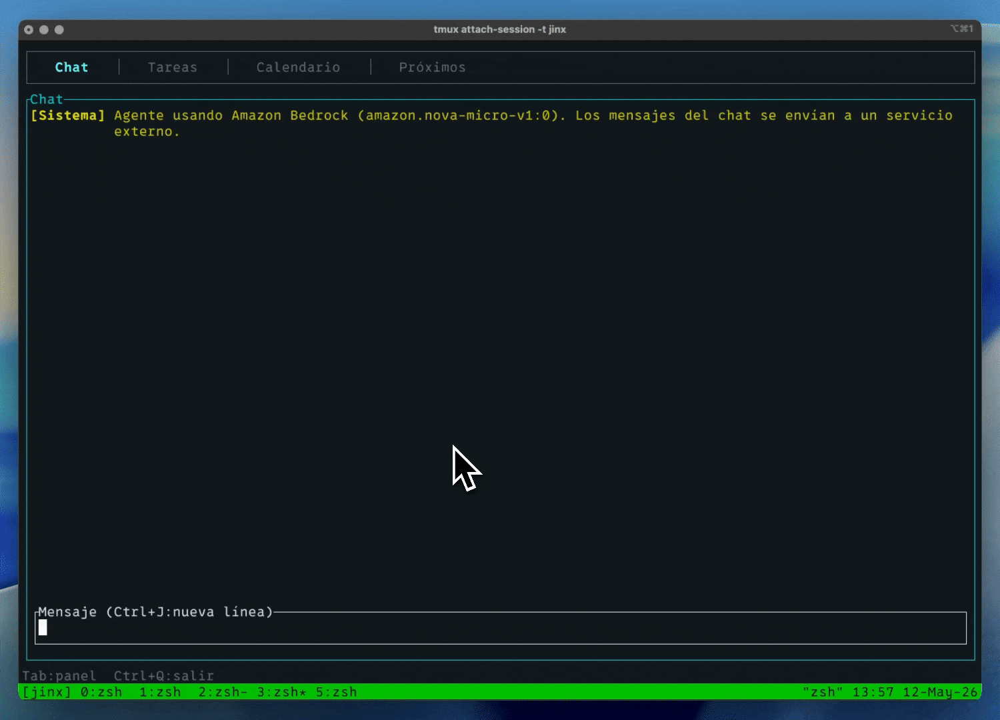

# jinx

Jinx es un organizador de día en terminal. Gestiona tareas y eventos que tengas en tu día día usando lenguaje natural.


## Instalación rápida

### macOS y Linux

```bash
curl -fsSL https://raw.githubusercontent.com/ramtoearth/jinx/main/scripts/install.sh | bash
```

El script descarga el binario precompilado para tu plataforma e instala `uv` si no lo tienes.

### Windows

```powershell
irm https://raw.githubusercontent.com/ramtoearth/jinx/main/scripts/install.ps1 | iex
```

### Instalación manual

Descarga el binario para tu sistema desde la [página de releases](https://github.com/ramtoearth/jinx/releases/latest):

| Sistema | Archivo |
|---------|---------|
| macOS Apple Silicon | `jinx-vX.Y.Z-aarch64-apple-darwin.tar.gz` |
| macOS Intel | `jinx-vX.Y.Z-x86_64-apple-darwin.tar.gz` |
| Linux x86-64 | `jinx-vX.Y.Z-x86_64-unknown-linux-gnu.tar.gz` |
| Linux ARM64 | `jinx-vX.Y.Z-aarch64-unknown-linux-gnu.tar.gz` |
| Windows x64 | `jinx-vX.Y.Z-x86_64-pc-windows-msvc.zip` |

Cada archivo incluye un `.sha256` para verificar la integridad de la descarga.

## Primeros pasos

Una vez instalado, necesitas Ollama con un modelo que soporte llamadas a herramientas:

```bash
# Instala Ollama (https://ollama.com)
ollama pull llama3.2:3b   # modelo recomendado (~2 GB)

# Inicia jinx
jinx
```

El primer arranque tarda ~30 segundos mientras `uv` instala las dependencias del agente en un entorno aislado. Los arranques posteriores son instantáneos.

## Configuración del modelo

Cambia el modelo directamente desde la app con **Ctrl+P**:



Selecciona el proveedor (Local/Remote), escribe el nombre del modelo y presiona Enter. El agente se reinicia automáticamente.

### Ollama (local)

Modelos con soporte de tool calling: `llama3.1`, `llama3.2`, `qwen3`.

### Amazon Bedrock (remote)

1. Autentícate con AWS CLI v2 (versión 2.32.0+):

```bash
aws login
```

Esto abre el navegador para iniciar sesión. Las credenciales se renuevan durante hasta 12 horas. Ver [documentación oficial](https://docs.aws.amazon.com/cli/latest/userguide/cli-configure-sign-in.html).

2. Activa el modelo en Bedrock (Amazon Bedrock → Model access) en tu región.

3. Abre **Ctrl+P** en jinx, selecciona Remote y escribe el model ID (ej: `anthropic.claude-3-5-sonnet-20241022-v2:0`).

## Compilar desde el código fuente

Si prefieres compilar tú mismo:

```bash
# Requisitos: Rust (https://rustup.rs), uv (https://astral.sh/uv), Ollama

git clone https://github.com/ramtoearth/jinx
cd jinx
cargo install --path tui
```
