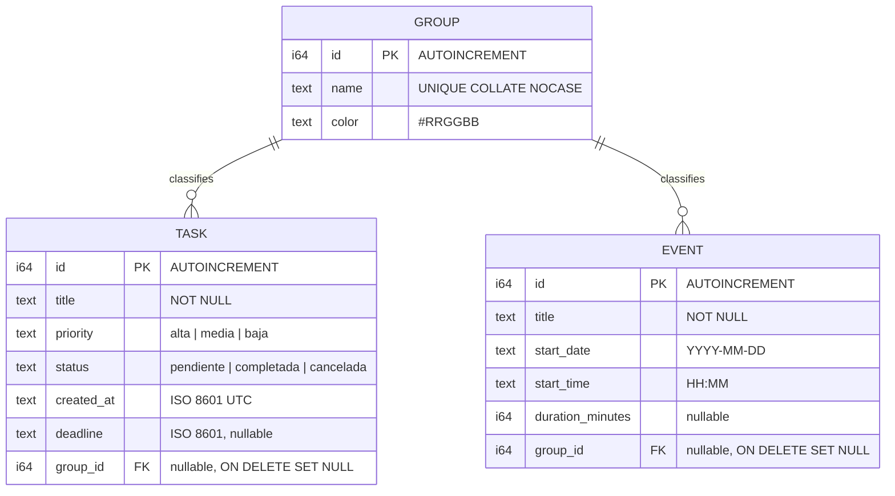
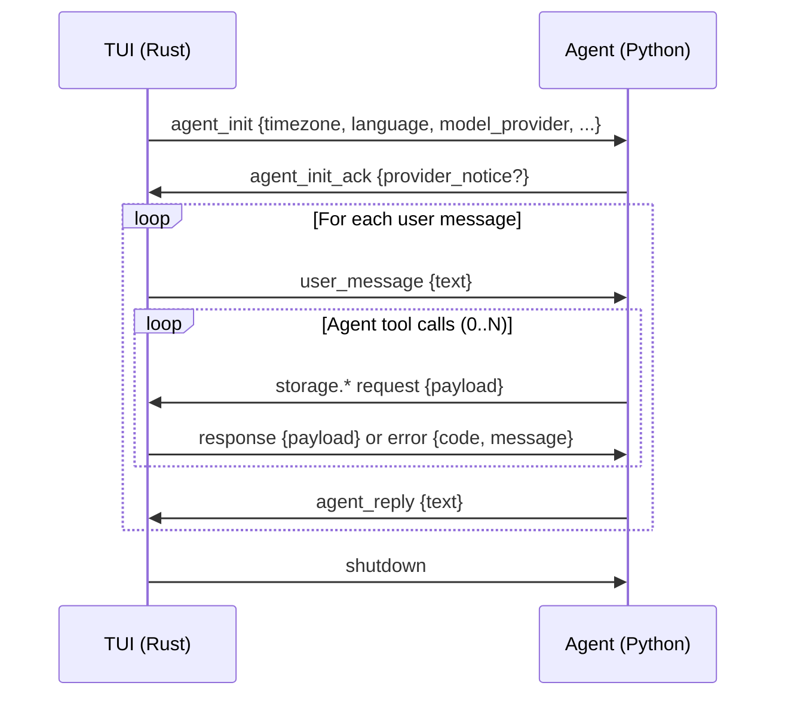
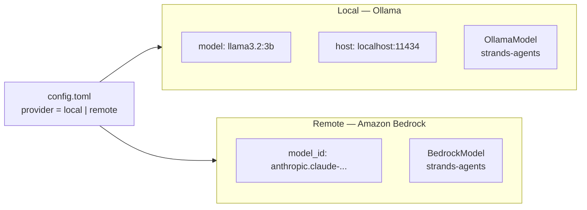
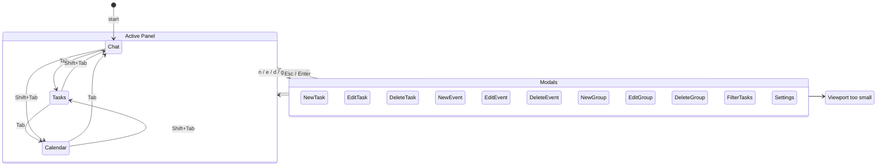

# Architecture

## 1. System Overview

jinx is a terminal day organizer composed of three layers: a Rust TUI, a Python AI agent, and a SQLite database. The TUI owns the database and renders the UI. The agent runs as a child process and communicates over JSON Lines on stdio. When the agent needs to read or write data, it sends a storage request back to the TUI, which executes it against SQLite and returns the result.

```mermaid
graph TB
    subgraph user["User"]
        KB[Keyboard]
    end

    subgraph tui["TUI — Rust (Ratatui)"]
        direction TB
        MAIN[main.rs<br/>Event Loop]
        APP[AppState<br/>reduce&#40;state, event&#41;]
        RENDER[Render Loop]
        IPC_H[ipc_handler.rs<br/>Storage Dispatcher]
        STORE[SqliteStorage<br/>storage crate]
        READER["Reader Thread<br/>mpsc::channel"]
    end

    subgraph channel["IPC — JSON Lines over stdio"]
        STDIN[agent stdin]
        STDOUT[agent stdout]
    end

    subgraph agent["Agent — Python (Strands Agents)"]
        direction TB
        LOOP[Turn Loop<br/>main.py]
        STRAND[Strands Agent<br/>LLM]
        STDIO[StdioClient<br/>ipc.py]
        STOOLS[Storage Tools<br/>storage_tools.py]
        BTOOLS[Built-in Tools<br/>strands_tools]
    end

    subgraph providers["Model Providers"]
        OLLAMA[Ollama<br/>local]
        BEDROCK[Amazon Bedrock<br/>remote]
    end

    subgraph disk["Disk"]
        DB[("SQLite<br/>~/.local/share/jinx/organizer.sqlite3")]
        LOG["/tmp/tui_agent.log"]
    end

    KB --> MAIN
    MAIN --> APP
    APP --> RENDER
    MAIN --> IPC_H
    IPC_H --> STORE
    STORE --> DB
    MAIN --> READER

    READER -->|parses JSON Lines| MAIN
    MAIN -->|writes JSON Lines| STDIN
    STDOUT -->|reads lines| READER

    LOOP --> STRAND
    STRAND --> STOOLS
    STRAND --> BTOOLS
    STOOLS --> STDIO
    STDIO -->|writes request| STDOUT
    STDIO -->|reads response| STDIN
    STRAND -->|streaming stderr| LOG

    STRAND --> OLLAMA
    STRAND --> BEDROCK
```



---

## 2. Workspace Structure

```
jinx/
├── Cargo.toml              # workspace root — members: storage, tui
├── storage/                 # Rust crate — SQLite database layer
│   └── src/
│       ├── lib.rs           # Storage trait (CRUD interface)
│       ├── models.rs        # Task, Event, Group, Priority, TaskStatus, HexColor
│       ├── db.rs            # SqliteStorage — migrations, queries, indices
│       ├── error.rs         # StorageError with canonical codes
│       ├── export.rs        # Markdown and SQLite export/import
│       └── path.rs          # Platform-specific DB path resolution
├── tui/                     # Rust crate — terminal UI binary
│   └── src/
│       ├── lib.rs           # Module exports
│       ├── main.rs          # Event loop, agent spawn, rendering, forms
│       ├── app.rs           # AppState, Panel, Modal, reduce()
│       ├── ipc.rs           # Envelope, MessageType, payload DTOs
│       ├── ipc_handler.rs   # Dispatches storage.* requests to Storage trait
│       ├── config.rs        # Config, Provider (Local/Remote)
│       ├── locale.rs        # i18n — loads TOML locale files
│       ├── color.rs         # Terminal color detection and style resolution
│       ├── calendario.rs    # Calendar layout logic
│       ├── proximos.rs      # 24-hour upcoming entries view
│       └── text_editor.rs   # Multi-line chat input widget
├── agent/                   # Python package — AI agent
│   ├── main.py              # Agent construction, turn loop
│   ├── ipc.py               # StdioClient, Envelope TypedDict
│   ├── storage_tools.py     # 17 @tool proxy functions
│   └── locale.py            # Agent locale loader
└── locales/                 # TOML locale files for TUI (en.toml, es.toml)
```

---

## 3. Data Model

SQLite with 4 versioned migrations. `schema_version` table tracks applied migrations.



**Indices**: `status+priority`, `deadline`, `group_id` on tasks; `start_date`, `group_id` on events.

**Storage trait** — 15 methods covering full CRUD for tasks, events, and groups plus `export_markdown`, `export_sqlite`, and `snapshot_for_inference`.

---

## 4. IPC Protocol

The TUI and agent communicate over JSON Lines (one JSON object per `\n`-terminated line) on the agent's stdin/stdout.

### Lifecycle



### Envelope

Every message shares this structure:

```json
{
  "v": 1,
  "id": "uuid-v4",
  "kind": "request | response | event",
  "type": "storage.create_task",
  "payload": { ... },
  "ref": "request-uuid",
  "error": { "code": "NOT_FOUND", "message": "..." }
}
```

### Message Types (22)

| Category | Types |
|----------|-------|
| Lifecycle | `agent_init`, `agent_init_ack`, `user_message`, `agent_reply`, `shutdown`, `agent_tool_progress` |
| Tasks | `storage.list_tasks`, `storage.create_task`, `storage.update_task`, `storage.complete_task`, `storage.delete_task` |
| Events | `storage.list_events`, `storage.create_event`, `storage.update_event`, `storage.delete_event` |
| Groups | `storage.list_groups`, `storage.create_group`, `storage.rename_group`, `storage.recolor_group`, `storage.delete_group` |
| Export | `storage.export_markdown`, `storage.export_sqlite` |

---

## 5. Model Providers

The agent supports two model providers, selected via `config.toml` or the Ctrl+P settings modal.



**Local (Ollama)**: Runs entirely on the user's machine. No data leaves the device. Requires Ollama installed with a tool-calling model (llama3.1, llama3.2, qwen3).

**Remote (Amazon Bedrock)**: Uses AWS credentials (`aws login`). Chat messages are sent to an external service. The provider notice in chat warns the user.

The model provider is configured in `~/.config/jinx/config.toml` and passed to the agent via the `agent_init` IPC message.

---

## 6. Agent Subprocess

The Python agent is embedded in the Rust binary at compile time and extracted at runtime.

### Spawn sequence

1. **Extract** — `extract_agent()` writes the embedded `.py` and `.toml` files to `~/.local/share/jinx/agent/`. Only writes files whose content has changed (idempotent).

2. **Launch** — Runs `uv run --project <agent_dir> python -m agent.main` as a child process with piped stdin/stdout. Stderr redirects to `/tmp/tui_agent.log`.

3. **Reader thread** — A background thread reads the agent's stdout line by line, parses JSON envelopes, and sends them to the main event loop via `mpsc::channel`.

4. **Handshake** — The TUI sends `agent_init` with timezone, language, model provider, and model config. The agent responds with `agent_init_ack` and an optional `provider_notice` displayed in chat.

5. **Turn loop** — For each `user_message`, the agent prepends `[NOW: ISO8601]` for date context, calls the Strands Agent (which may invoke storage tools in a loop), and returns `agent_reply`.

6. **Shutdown** — On Ctrl+Q the TUI sends a `shutdown` message, waits up to 500ms with `try_wait()`, then kills the process if it hasn't exited.

### Agent tools

The agent has 22 tools: 5 built-in (`current_time`, `file_read`, `file_write`, `editor`, `think`) and 17 storage proxies. Each storage tool sends a typed IPC request to the TUI and blocks until the response arrives.

---

## 7. TUI State Machine

The TUI uses a pure reduction model: `reduce(AppState, AppEvent) → AppState`.



**RuntimeState** holds all mutable TUI state: scroll positions, cursors, form state, chat history, agent subprocess handles, and a reference to the `Storage` trait object.

**Rendering** — Three panels laid out with ratatui constraints. Chat on the left (with multi-line editor), Tasks+Groups in the center, Calendar on the right. Modals render as centered overlays. A status bar at the bottom shows hints, errors, and a spinner when the agent is working.

---

## 8. Project Layers

```mermaid
graph BT
    subgraph workspace["Cargo Workspace"]
        subgraph storage_crate["crate: storage"]
            MODELS[models.rs<br/>Task, Event, Group<br/>Priority, TaskStatus, HexColor]
            DB[db.rs<br/>SqliteStorage<br/>4 migrations]
            EXPORT[export.rs<br/>Markdown + SQLite export]
            ERROR[error.rs<br/>StorageError]
            PATH[path.rs<br/>resolve_db_path]
            LIB_S[lib.rs<br/>Storage trait]
        end

        subgraph tui_crate["crate: tui (binary)"]
            MAIN_RS[main.rs<br/>Event loop, render<br/>agent spawn, forms]
            APP_RS[app.rs<br/>AppState, reduce&#40;&#41;]
            IPC_RS[ipc.rs<br/>Envelope, MessageType<br/>payload DTOs]
            IPC_HAND[ipc_handler.rs<br/>Dispatcher]
            CONFIG_RS[config.rs<br/>Provider, Config]
            COLOR_RS[color.rs<br/>ColorMode detection]
            CAL_RS[calendario.rs]
            LOCALE_RS[locale.rs<br/>i18n]
        end
    end

    subgraph py_pkg["Python Package: agent/"]
        IPC_PY[ipc.py<br/>StdioClient<br/>Envelope TypedDicts]
        STOR_T[storage_tools.py<br/>17 @tool proxies]
        MAIN_PY[main.py<br/>Turn loop, _build_agent]
        STRANDS[strands-agents SDK<br/>+ strands-agents-tools]
    end

    subgraph providers_layer["Model Providers"]
        OLLAMA_P[Ollama<br/>OllamaModel]
        BEDROCK_P[Amazon Bedrock<br/>BedrockModel]
    end

    DB --> LIB_S
    MODELS --> LIB_S
    EXPORT --> LIB_S
    PATH --> LIB_S

    LIB_S --> IPC_HAND
    IPC_RS --> IPC_HAND
    IPC_HAND --> MAIN_RS
    APP_RS --> MAIN_RS
    CONFIG_RS --> MAIN_RS
    LOCALE_RS --> MAIN_RS

    STOR_T --> IPC_PY
    STRANDS --> MAIN_PY
    STOR_T --> MAIN_PY
    IPC_PY --> MAIN_PY

    MAIN_PY --> OLLAMA_P
    MAIN_PY --> BEDROCK_P
```



---

## 9. Error Handling

Storage errors use canonical machine-readable codes propagated through IPC:

| Code | Meaning |
|------|---------|
| `NOT_FOUND` | Entity does not exist |
| `VALIDATION_FAILED` | Invalid input (bad color, empty title) |
| `GROUP_NAME_NOT_UNIQUE` | Duplicate group name |
| `FOREIGN_KEY_VIOLATION` | Referenced group does not exist |
| `IO_NOT_WRITABLE` | Export path not writable |
| `IO_READ_FAILED` | Import source unreadable |
| `SCHEMA_MIGRATION_FAILED` | Database migration error |

On the agent side, `StorageError` is caught and returned as a user-visible message in `agent_reply`. Unexpected exceptions are caught with a generic error wrapper.

---

## 10. Platform Paths

| Resource | macOS | Linux |
|----------|-------|-------|
| Database | `~/Library/Application Support/jinx/organizer.sqlite3` | `~/.local/share/jinx/organizer.sqlite3` |
| Config | `~/Library/Application Support/jinx/config.toml` | `~/.config/jinx/config.toml` |
| Agent code | `~/Library/Application Support/jinx/agent/` | `~/.local/share/jinx/agent/` |
| Agent log | `/tmp/tui_agent.log` | `/tmp/tui_agent.log` |
