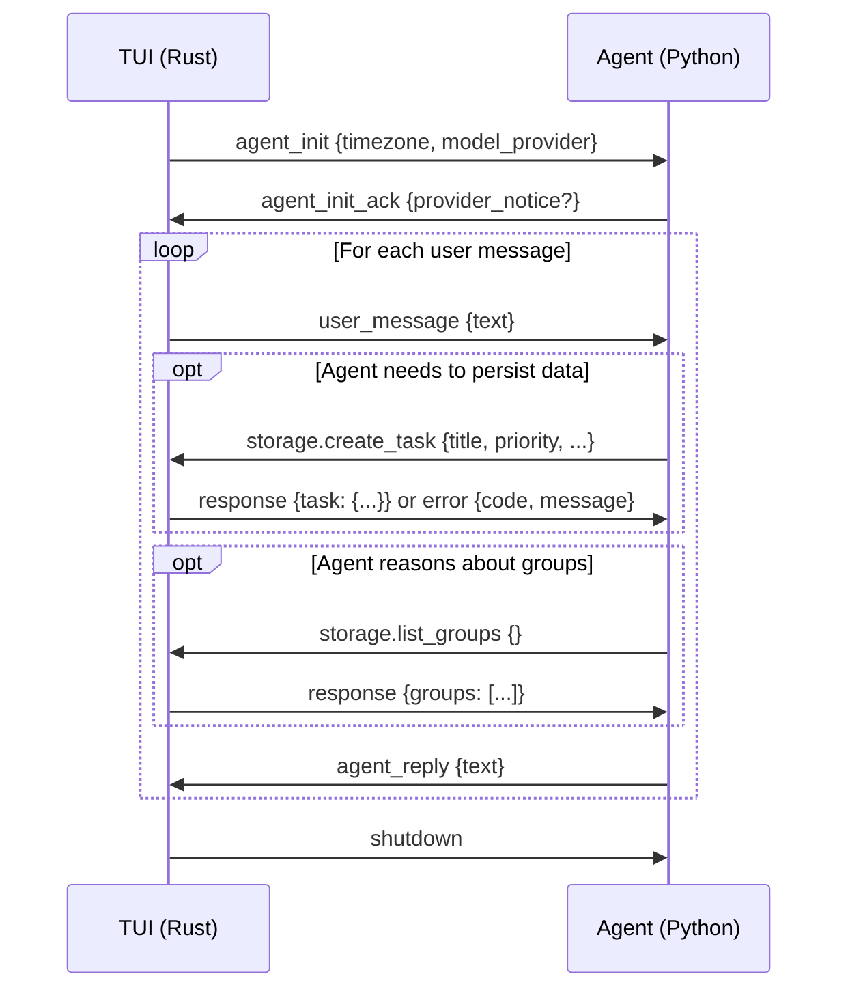
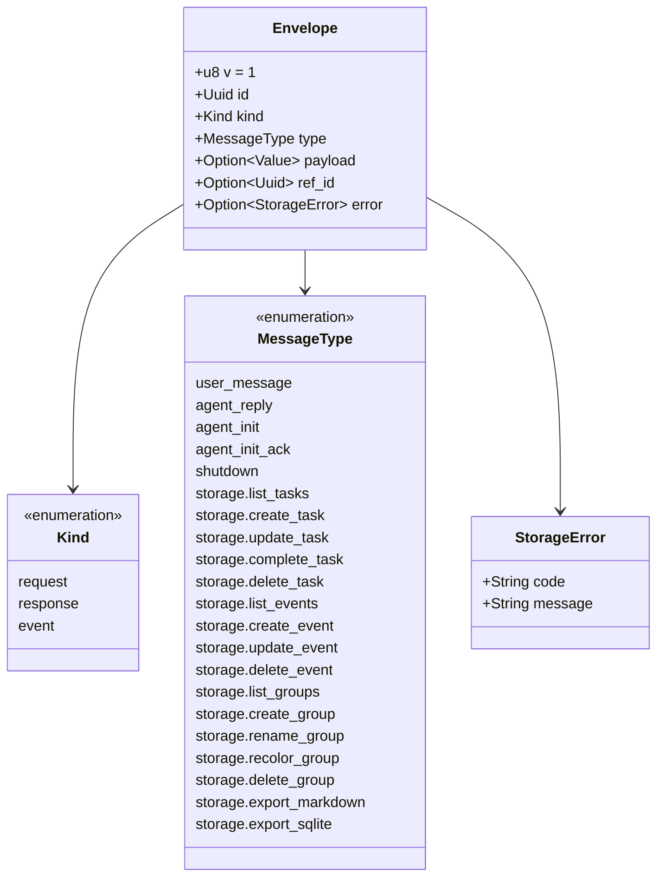
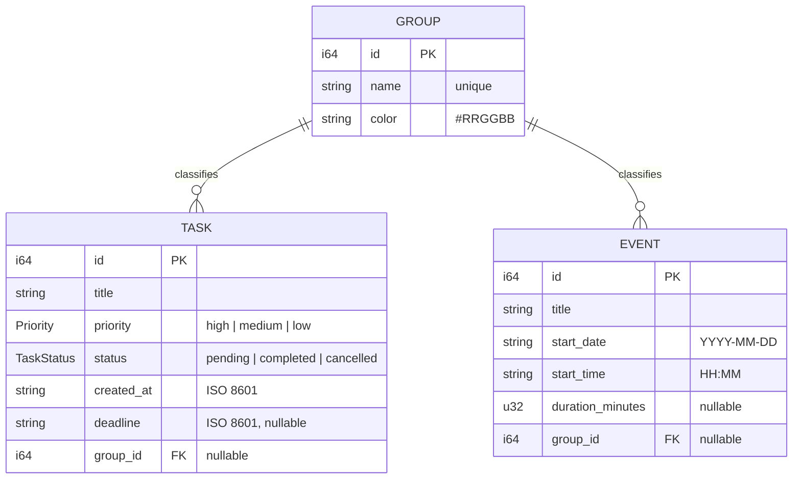
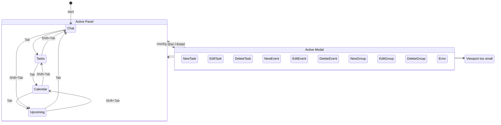

# Architecture — Terminal Day Organizer

## 1. General System Architecture

```mermaid
graph TB
    subgraph user["User"]
        KB[Keyboard]
    end

    subgraph tui["TUI — Rust (Ratatui)"]
        direction TB
        RENDER[Render Loop<br/>60 fps]
        APP[AppState<br/>reduce&#40;state, event&#41;]
        MAIN[main.rs<br/>Event Loop]
        STORE[SqliteStorage<br/>storage crate]
        IPC_H[ipc_handler.rs<br/>Storage Dispatcher]
        READER["Reader Thread<br/>mpsc::channel"]
    end

    subgraph channel["IPC Channel — JSON Lines over stdio"]
        STDIN[agent stdin]
        STDOUT[agent stdout]
    end

    subgraph agent["Agent — Python (Strands Agents)"]
        direction TB
        LOOP[Turn Loop<br/>main.py]
        STRAND[Strands Agent<br/>Claude LLM]
        STDIO[StdioClient<br/>ipc.py]
        STOOLS[Storage Tools<br/>storage_tools.py]
        BTOOLS[Built-in Tools<br/>strands_tools]
        INFER[Inference Engine<br/>inference.py]
    end

    subgraph disk["Disk"]
        DB[("SQLite<br/>~/.local/share/<br/>terminal-day-organizer/db.sqlite")]
        LOG["/tmp/tui_agent.log"]
    end

    KB --> MAIN
    MAIN --> APP
    APP --> RENDER
    MAIN --> IPC_H
    IPC_H --> STORE
    STORE --> DB
    MAIN --> READER

    READER -->|parses JSON Lines| MAIN
    MAIN -->|writes JSON Lines| STDIN
    STDOUT -->|reads lines| READER

    LOOP --> STRAND
    STRAND --> STOOLS
    STRAND --> BTOOLS
    STRAND --> INFER
    STOOLS --> STDIO
    STDIO -->|writes request| STDOUT
    STDIO -->|reads response| STDIN
    STRAND -->|streaming stderr| LOG
```



---

## 2. IPC Protocol — IPC Channel (JSON Lines)



---

## 3. IPC Envelope Structure



---

## 4. Data Model (SQLite Store)



---

## 5. TUI State Flow — pure reduction machine



---

## 6. Group Inference Engine

```mermaid
flowchart TD
    MSG[User message] --> NORM[normalize\nlowercase + strip accents]
    NORM --> TRI[ngrams n=3\nwith space padding]
    
    TRI --> JAC{For each Group}
    
    subgraph per_group["For each Group in the snapshot"]
        GNORM[normalize name + member titles]
        GTRI[Group ngrams]
        SCORE[Jaccard similarity\n|A ∩ B| / |A ∪ B|]
        GNORM --> GTRI --> SCORE
    end
    
    JAC --> per_group
    
    per_group --> ARGMAX[argmax score\ntie-break → lowest id]
    
    ARGMAX --> THRESH{score ≥ threshold?}
    
    THRESH -->|score ≥ 0.35 AUTO| ASSIGN[Auto-assign Group]
    THRESH -->|0.20 ≤ score < 0.35| SUGGEST[Suggest with confirmation]
    THRESH -->|score < 0.20| NEW[Propose creating new Group]
```

---

## 7. Project Layers (Cargo workspace + Python package)

```mermaid
graph BT
    subgraph workspace["Cargo Workspace"]
        subgraph storage_crate["crate: storage"]
            MODELS[models.rs\nTask, Event, Group\nPriority, TaskStatus\nHexColor]
            DB[db.rs\nSqliteStorage]
            EXPORT[export.rs\nExporter MD + SQLite]
            ERROR[error.rs\nStorageError]
            PATH[path.rs\nresolve_db_path]
            LIB_S[lib.rs\nStorage trait]
        end

        subgraph tui_crate["crate: tui"]
            IPC_RS[ipc.rs\nEnvelope, MessageType\nIPC layer DTOs]
            IPC_HAND[ipc_handler.rs\nDispatcher storage.*]
            APP_RS[app.rs\nAppState, Panel\nreduce&#40;&#41;]
            MAIN_RS[main.rs\nEvent loop, render\nmodals, forms]
            COLOR_RS[color.rs]
            CAL_RS[calendar.rs]
            PROX_RS[upcoming.rs]
        end
    end

    subgraph py_pkg["Python Package: agent/"]
        IPC_PY[ipc.py\nStdioClient\nEnvelope TypedDicts]
        STOR_T[storage_tools.py\n16 @tools proxy]
        INFER_PY[inference.py\ninfer_group_candidate]
        MAIN_PY[main.py\nTurn loop\n_build_agent]
        STRANDS_T[strands_tools\ncurrent_time, file_read\nfile_write, editor, think]
    end

    DB --> LIB_S
    MODELS --> LIB_S
    EXPORT --> LIB_S
    PATH --> LIB_S

    LIB_S --> IPC_HAND
    IPC_RS --> IPC_HAND
    IPC_RS --> APP_RS
    IPC_HAND --> MAIN_RS
    APP_RS --> MAIN_RS

    STOR_T --> IPC_PY
    INFER_PY --> MAIN_PY
    STRANDS_T --> MAIN_PY
    STOR_T --> MAIN_PY
    IPC_PY --> MAIN_PY
```


