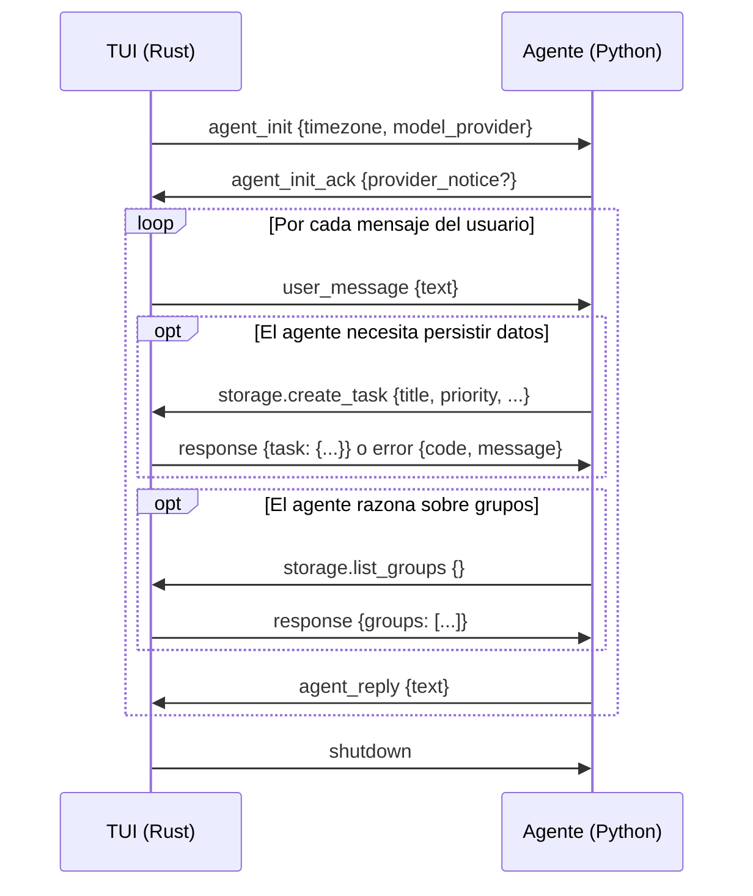
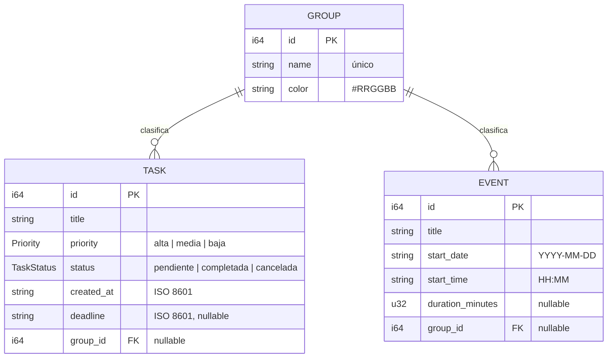
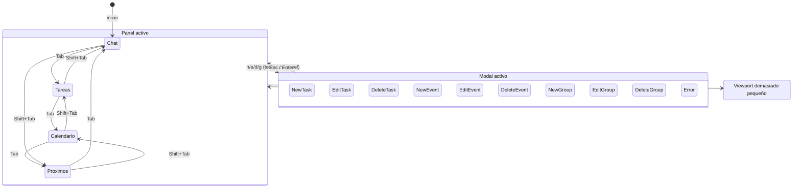

# Arquitectura — Terminal Day Organizer

## 1. Arquitectura general del sistema

```mermaid
graph TB
    subgraph usuario["Usuario"]
        KB[Teclado]
    end

    subgraph tui["TUI — Rust (Ratatui)"]
        direction TB
        RENDER[Render Loop<br/>60 fps]
        APP[AppState<br/>reduce&#40;state, event&#41;]
        MAIN[main.rs<br/>Event Loop]
        STORE[SqliteStorage<br/>storage crate]
        IPC_H[ipc_handler.rs<br/>Storage Dispatcher]
        READER["Reader Thread<br/>mpsc::channel"]
    end

    subgraph canal["Canal_IPC — JSON Lines over stdio"]
        STDIN[stdin del agente]
        STDOUT[stdout del agente]
    end

    subgraph agente["Agente — Python (Strands Agents)"]
        direction TB
        LOOP[Turn Loop<br/>main.py]
        STRAND[Strands Agent<br/>Claude LLM]
        STDIO[StdioClient<br/>ipc.py]
        STOOLS[Storage Tools<br/>storage_tools.py]
        BTOOLS[Built-in Tools<br/>strands_tools]
        INFER[Inference Engine<br/>inference.py]
    end

    subgraph disk["Disco"]
        DB[("SQLite<br/>~/.local/share/<br/>terminal-day-organizer/db.sqlite")]
        LOG["/tmp/tui_agent.log"]
    end

    KB --> MAIN
    MAIN --> APP
    APP --> RENDER
    MAIN --> IPC_H
    IPC_H --> STORE
    STORE --> DB
    MAIN --> READER

    READER -->|parsea JSON Lines| MAIN
    MAIN -->|escribe JSON Lines| STDIN
    STDOUT -->|lee líneas| READER

    LOOP --> STRAND
    STRAND --> STOOLS
    STRAND --> BTOOLS
    STRAND --> INFER
    STOOLS --> STDIO
    STDIO -->|escribe request| STDOUT
    STDIO -->|lee response| STDIN
    STRAND -->|streaming stderr| LOG
```



---

## 2. Protocolo IPC — Canal_IPC (JSON Lines)



---

## 3. Estructura del Envelope IPC

```mermaid
classDiagram
    class Envelope {
        +u8 v = 1
        +Uuid id
        +Kind kind
        +MessageType type
        +Option~Value~ payload
        +Option~Uuid~ ref_id
        +Option~StorageError~ error
    }

    class Kind {
        <<enumeration>>
        request
        response
        event
    }

    class MessageType {
        <<enumeration>>
        user_message
        agent_reply
        agent_init
        agent_init_ack
        shutdown
        storage.list_tasks
        storage.create_task
        storage.update_task
        storage.complete_task
        storage.delete_task
        storage.list_events
        storage.create_event
        storage.update_event
        storage.delete_event
        storage.list_groups
        storage.create_group
        storage.rename_group
        storage.recolor_group
        storage.delete_group
        storage.export_markdown
        storage.export_sqlite
    }

    class StorageError {
        +String code
        +String message
    }

    Envelope --> Kind
    Envelope --> MessageType
    Envelope --> StorageError
```



---

## 4. Modelo de datos (Almacén SQLite)



---

## 5. Flujo de estado del TUI — máquina de reducción pura



---

## 6. Motor de inferencia de Grupos

```mermaid
flowchart TD
    MSG[Mensaje del usuario] --> NORM[normalize\nlowercase + strip acentos]
    NORM --> TRI[ngrams n=3\ncon padding de espacios]
    
    TRI --> JAC{Para cada Grupo}
    
    subgraph por_grupo["Por cada Grupo en el snapshot"]
        GNORM[normalize nombre + títulos miembros]
        GTRI[ngrams del Grupo]
        SCORE[Jaccard similarity\n|A ∩ B| / |A ∪ B|]
        GNORM --> GTRI --> SCORE
    end
    
    JAC --> por_grupo
    
    por_grupo --> ARGMAX[argmax score\ntie-break → id más bajo]
    
    ARGMAX --> THRESH{score ≥ umbral?}
    
    THRESH -->|score ≥ 0.35 AUTO| ASSIGN[Auto-asignar Grupo]
    THRESH -->|0.20 ≤ score < 0.35| SUGGEST[Sugerir con confirmación]
    THRESH -->|score < 0.20| NEW[Proponer crear Grupo nuevo]
```

---

## 7. Capas del proyecto (workspace Cargo + paquete Python)

```mermaid
graph BT
    subgraph workspace["Cargo Workspace"]
        subgraph storage_crate["crate: storage"]
            MODELS[models.rs\nTask, Event, Group\nPriority, TaskStatus\nHexColor]
            DB[db.rs\nSqliteStorage]
            EXPORT[export.rs\nExporter MD + SQLite]
            ERROR[error.rs\nStorageError]
            PATH[path.rs\nresolve_db_path]
            LIB_S[lib.rs\nStorage trait]
        end

        subgraph tui_crate["crate: tui"]
            IPC_RS[ipc.rs\nEnvelope, MessageType\nDTOs de la capa IPC]
            IPC_HAND[ipc_handler.rs\nDispatcher storage.*]
            APP_RS[app.rs\nAppState, Panel\nreduce&#40;&#41;]
            MAIN_RS[main.rs\nEvent loop, render\nmodales, formularios]
            COLOR_RS[color.rs]
            CAL_RS[calendario.rs]
            PROX_RS[proximos.rs]
        end
    end

    subgraph py_pkg["Paquete Python: agent/"]
        IPC_PY[ipc.py\nStdioClient\nEnvelope TypedDicts]
        STOR_T[storage_tools.py\n16 @tools proxy]
        INFER_PY[inference.py\ninfer_group_candidate]
        MAIN_PY[main.py\nTurn loop\n_build_agent]
        STRANDS_T[strands_tools\ncurrent_time, file_read\nfile_write, editor, think]
    end

    DB --> LIB_S
    MODELS --> LIB_S
    EXPORT --> LIB_S
    PATH --> LIB_S

    LIB_S --> IPC_HAND
    IPC_RS --> IPC_HAND
    IPC_RS --> APP_RS
    IPC_HAND --> MAIN_RS
    APP_RS --> MAIN_RS

    STOR_T --> IPC_PY
    INFER_PY --> MAIN_PY
    STRANDS_T --> MAIN_PY
    STOR_T --> MAIN_PY
    IPC_PY --> MAIN_PY
```


